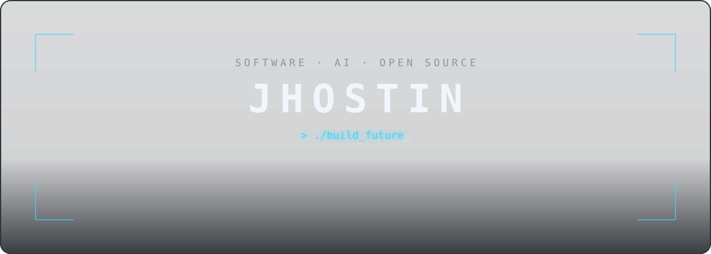
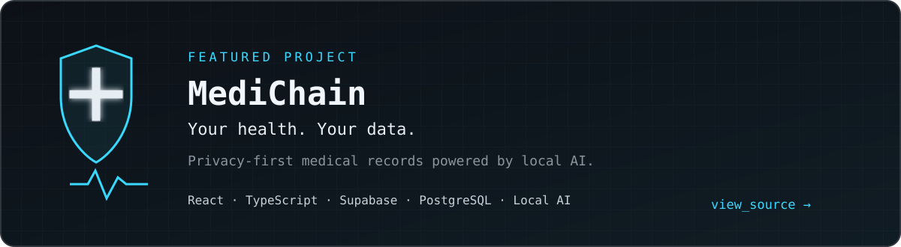
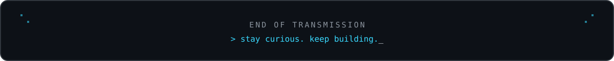

<div align="center">

<picture>
  <source media="(prefers-color-scheme: dark)" srcset="./assets/hero-dark.svg">
  <source media="(prefers-color-scheme: light)" srcset="./assets/hero-light.svg">
  
</picture>

<br>

<samp>building useful software at the edge of code and intelligence.</samp>

</div>

<br>

## `01 // hello_world`

I'm **Jhostin**, a software developer interested in the systems behind the interface—from reliable backends and data layers to local AI and open-source tools. I like turning *“what if?”* into software people can actually use.

```python
jhostin = {
    "focus": ["Software Development", "Artificial Intelligence"],
    "interests": ["Backend", "Web", "Mobile", "Open Source"],
    "languages": ["Python", "TypeScript", "JavaScript", "C++"],
    "currently_exploring": ["Local AI", "System Design", "Cloud"],
    "os": "Linux 🐧"
}
```


## `02 // toolkit`

<div align="center">

**Languages**

[](https://skillicons.dev)

**Frontend & Mobile**

[](https://skillicons.dev)

**Backend & Data**

[](https://skillicons.dev)

**Tools & Platforms**

[](https://skillicons.dev)

</div>


## `03 // featured_build`

<a href="https://github.com/Jhostin-dev/MediChain">
  
</a>

## `04 // problem_solving`

```text
$ solve --mode competitive
  ├─ algorithms      → breaking large problems into precise steps
  ├─ data structures → choosing the right shape for the job
  ├─ languages       → Python / C++
  └─ objective       → learn, optimize, repeat
```


## `05 // signal`

<div align="center">
  <picture>
    <source media="(prefers-color-scheme: dark)" srcset="https://github-profile-summary-cards.vercel.app/api/cards/stats?username=Jhostin-dev&theme=github_dark&title_color=39d9ff&icon_color=39d9ff&border_color=30363d">
    <source media="(prefers-color-scheme: light)" srcset="https://github-profile-summary-cards.vercel.app/api/cards/stats?username=Jhostin-dev&theme=github&title_color=0969da&icon_color=0969da&border_color=d0d7de">
    
  </picture>
  <picture>
    <source media="(prefers-color-scheme: dark)" srcset="https://github-profile-summary-cards.vercel.app/api/cards/repos-per-language?username=Jhostin-dev&theme=github_dark&title_color=39d9ff&icon_color=39d9ff&chart_color=39d9ff&border_color=30363d">
    <source media="(prefers-color-scheme: light)" srcset="https://github-profile-summary-cards.vercel.app/api/cards/repos-per-language?username=Jhostin-dev&theme=github&title_color=0969da&icon_color=0969da&chart_color=0969da&border_color=d0d7de">
    
  </picture>
</div>

<picture>
  <source media="(prefers-color-scheme: dark)" srcset="https://github-profile-summary-cards.vercel.app/api/cards/profile-details?username=Jhostin-dev&theme=github_dark&title_color=39d9ff&icon_color=39d9ff&chart_color=39d9ff&border_color=30363d">
  <source media="(prefers-color-scheme: light)" srcset="https://github-profile-summary-cards.vercel.app/api/cards/profile-details?username=Jhostin-dev&theme=github&title_color=0969da&icon_color=0969da&chart_color=0969da&border_color=d0d7de">
  
</picture>

## `06 // contribution_arcade`

<picture>
  <source media="(prefers-color-scheme: dark)" srcset="https://raw.githubusercontent.com/Jhostin-dev/Jhostin-dev/output/pacman-contribution-graph-dark.svg">
  <source media="(prefers-color-scheme: light)" srcset="https://raw.githubusercontent.com/Jhostin-dev/Jhostin-dev/output/pacman-contribution-graph.svg">
  
</picture>

<!--
## `07 // learning_streak`

Duolingo can be enabled here once a reliable public integration is available.
Never place a password, session token, or private credential in this README.
-->


## `07 // connect`

<div align="center">

[](https://github.com/Jhostin-dev)

<!-- Add verified LinkedIn, portfolio, or email links here when ready. -->

<br>



</div>

